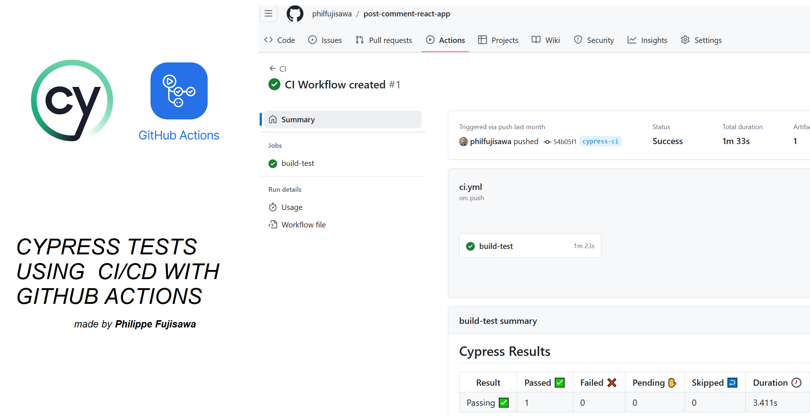

# Post Comment React App

_Este projeto é uma aplicação simples que permite aos usuários criar posts e adicionar comentários a eles. O projeto está configurado para automação de testes e integração contínua utilizando GitHub Actions._

### Pré-requisitos

Certifique-se de ter o Node.js instalado em seu sistema antes de executar este aplicativo.

- Node.js: [Baixe aqui](https://nodejs.org)

### Instalação

1. Clone o repositório para o seu diretório local:

```
git clone https://github.com/philfujisawa/post-comment-react-app.git
```
2. Navegue até o diretório do projeto:

```
cd <nome do diretório>
```
3. Instale as dependências necessárias:
```
npm install
```

### Executando o Aplicativo

Depois de concluir a instalação, você pode iniciar o aplicativo executando o seguinte comando:
```
npm run dev
```
Isso iniciará o aplicativo React em modo de desenvolvimento. Abra o navegador e acesse `http://localhost:5173` para visualizar o aplicativo.

Qualquer alteração no código-fonte será automaticamente recarregada no navegador.


### Construção do Projeto

Para criar uma versão otimizada do aplicativo para produção, execute o seguinte comando:

```
npm run build
```
Isso criará uma pasta `build` no diretório do projeto com os arquivos otimizados para produção.

Rode os testes em Cypress:
```
npx cypress open
```

