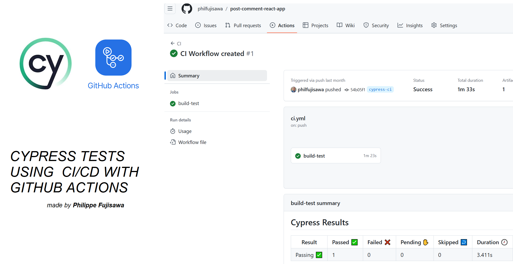

# Post Comment React App

_This project is a simple application that allows users to create posts and add comments to them.The project is set up for tests automation and continuous integration using GitHub Actions._

**Para README em Português acessar no repositório o documento README-PTBR.md**

### Prerequisites

You will need to instal:
+ [Node.js](https://nodejs.org)

### Installation Steps

1. Clone this repository:

```
git clone https://github.com/philfujisawa/post-comment-react-app.git
```
2. Navigate to project directory. Choose directory based on where you cloned the repository:

```
cd path/to/directory/post-comment-react-app
```
3. Install the project dependencies:

```
npm install
```

### Run the app

After finish installation, you can run with this command:

```
npm run dev
```
This will start the React application in development mode. Open your browser and go to http://localhost:5173 to view the application.

### Project build

To create an optimized production build of the application, run the following command:
```
npm run build
```
This will create a `build` folder in the project directory containing the optimized files for production.

Now run cypress tests:
```
npx cypress open
```
Thank you so much!
